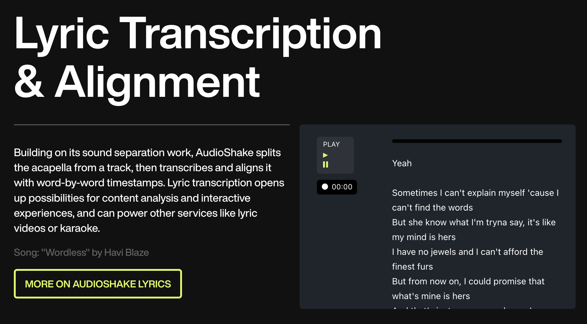
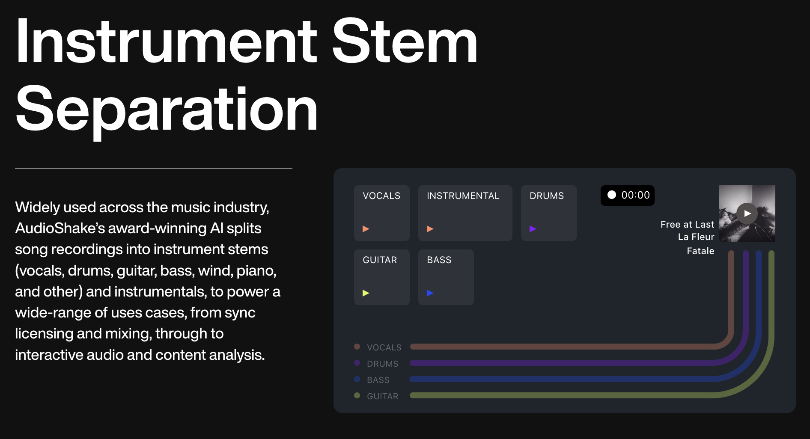
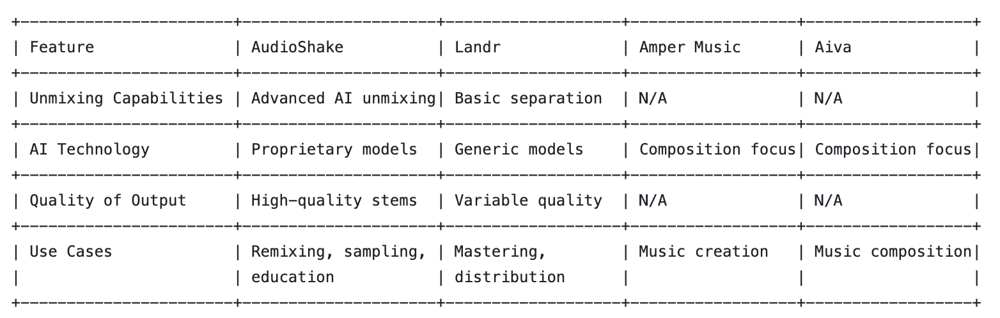

# **AudioShake: A Case Study about how AI-Driven Unmixing of a Song is Revolutionizing Music**

## Overview and Origin

* Name of company

AudioShake (https://www.audioshake.ai/)

* When was the company incorporated?

AudioShake was founded in 2018 and launched in 2021.

* Who are the founders of the company?

Jessica Powell & Luke Miner are the founders of AudioShake. [AudioShake Website, https://www.audioshake.ai/team]

* How did the idea for the company (or project) come about?

The concept emerged from a personal need. Jessica Powell mentioned, "It started with our love for karaoke and the desire to make any song karaoke-ready. This simple idea, fueled by advancements in AI, led us to explore the broader applications of 'source separation' technology in the music industry." [SoundBreaker Podcast on AudioShake's YouTube Channel, https://www.youtube.com/watch?v=2o-7XPlBtnU]

Today, that is exactly what the company does using AI to bridge gaps in music production and distribution, specifically addressing the challenge of remixing and repurposing existing music tracks in unique ways across the Entertainment Industry. AudioShake has been publicly aclaimed and recognized for its award-winning AI-powered stem separation technology, which has contributed to a growing customer base. The company has also expanded its offerings with the launch of LyricSync, a new service that complements its existing technology. 

* How is the company funded? How much funding have they received?

As of January 2024, AudioShake has secured $1.4 million in pre-seed funding. [Crunchbase, https://www.crunchbase.com/organization/audioshake/signals_and_news]

## Business Activities

* What specific problem is the company or project trying to solve?

AudioShake tackles the challenge of separating music into its constituent parts, like vocals and instruments, from a mixed track. This capability opens up new avenues for remixes, sync licensing, and music education. The company demonstrates its utility in diverse projects, from enhancing fan engagement to facilitating music mixing and mastering. 

 The company's AI music-separation technology allows musicians, audio engineers, producers, publishers, labels and other content creators to apply their audio content to new uses in karaoke, sync licensing, re-mixes, spatial audio, VR/AR, gaming, dubbing and social apps.

See specific case studies at https://www.audioshake.ai/case-studies 

* Who is the company's intended customer? Is there any information about the market size of this set of customers?

AudioShake's primary users include music producers, remix artists, musicologists, educators, and companies involved in sync licensing to utilize music stems (ie. components of music like instrumentals, voice, etc) in movies/film/tv/video and other commercial consumptive experiences.

Regarding Market Size, AudioShake's market touches upon 3 key markets within the Music Industry:

1. Music Production Software Market

AudioShake's tools can be considered part of the music production software market due to its services offering AI-driven solutions for unmixing songs. This market includes digital audio workstations (DAWs), plugins, and various tools used in music production. According to LinkedIn, Grand View Research reported that the global music production software market was valued at $447.62 million in 2022, and is expected to reach $724.79 million by 2028, with a compound annual growth rate (CAGR) of 8.36%. The report also states that the market will grow at a CAGR of 5.6%, reaching $1.7 billion by 2030. [Grand View Research, (https://www.linkedin.com/pulse/music-production-software-market-size-projected-loqtf/)]

2. AI in Music Market

The application of AI in Music encompasses multiple sectors within the Music Industry from composition, production, recommendation systems, and more. AudioShake's focus on using AI for unmixing tracks places it within this innovative & lucrative segment. According to this market research by the firm Future Data Stats, the global Artificial Intelligence in Music and Audio Market size was valued at USD 5.40 billion in 2022 and is projected to expand at a compound annual growth rate (CAGR) of 20.6% during the forecast period, reaching a value of USD 22.89 billion by 2030. See more ar (https://www.linkedin.com/pulse/music-audio-ai-market-dynamics-industry-insight-future-data-stats-70dzf/).

3. Music Licensing and Sync Market

AudioShake's technology has significant impactfulapplications in music licensing and synchronization (sync), particularly used for creating stems for TV, film, and advertisements. According to the Market Statsville Group (MSG), the global music licensing solution market size is expected to grow at a CAGR of 6.1% from 2023 to 2033. [Music Licensing Solution Market Size 2023, (https://www.linkedin.com/pulse/music-licensing-solution-market-size-expected-grow-cagr-ahirwar/)]

* What solution does this company offer that their competitors do not or cannot offer? (What is the unfair advantage they utilize?)

Unlike traditional methods that require access to the original multi-track recordings, AudioShake’s AI-driven platform can unmix any finished song into vocals, drums, and other instruments, providing unparalleled flexibility and creativity in music production. Other solutions do not leverage AI so they have failed in the past and are lower quality.

Thus, AudioShake distinguishes itself through its AI-driven technology that can unmix any song into high-quality stems, unlike competitors that often require original multi-track recordings. Powell states, "Our AI models are trained on a diverse dataset, enabling them to handle a wide range of music genres and production styles, setting us apart from the rest." [AudioShake, https://www.audioshake.ai/faq & NAM Conference Panel https://www.linkedin.com/posts/audioshake_ai-music-creation-activity-7167952439667621888-LqKa/ ]

* Which technologies are they currently using, and how are they implementing them? (This may take a little bit of sleuthing&mdash;you may want to search the company’s engineering blog or use sites like Stackshare to find this information.)

The core of AudioShake's offering is its proprietary AI models, the "AudioShake DME Model", "AI Stem Separation Model," and "Automated Speech Recognition Model" which utilize advanced machine learning techniques for precise audio signal processing. 

Overall, they leverage advanced AI algorithms and machine learning techniques for audio signal processing, capable of analyzing and separating complex audio tracks into clean, usable stems. Their LLM model is proprietary leveraging many speech transcription and captioning service partners to clean dialogue before it goes through aAutomated speech recognition (ASR).

References:

[AudioShake ASR Model Blog post, (https://www.audioshake.ai/post/new-benchmark-for-higher-quality-lyrics-transcription-from-audioshake-research)]

For example, see details on how AudioShake's research team described their latest stem models for how their piano models specifically trained to understand a wide range of pianos and tonalities at https://www.audioshake.ai/post/piano-stems-research-classical-music-pop 

General Tech Overview at https://www.audioshake.ai/post/doubling-down-on-dubbing

Try out the technology live at the links below:
[Dialogue, Music, & Effects Separation](image-3.png)

Other insight into the technology of the developer docs, website and audio inputs supported are below:
 The APIs are JSON & Javascript based for easy usability.

 AudioShake supports the following audio file inputs and can support up to 192kHz, which can be exported in the following file formats: WAV, MP3, AAC, FLAC, AIFF, and PCM. For Lyric transcriptions, AudioShake can export text as JSON or TXT files. 

## Landscape

* What field is the company in?
AudioShake is a Music Tech company, with a focus on AI applications for music production, sync, distribution and archival purposes.

* What have been the major trends and innovations of this field over the last 5&ndash;10 years?
The rise of AI in music over the last decade has been marked by the development of tools for composition, production, and analysis. AudioShake's introduction of accessible, high-quality unmixing technology is at the forefront of these innovations.

* What are the other major companies in this field?
Competitors and peers include other AI music tech firms like Landr, Amper Music, and Aiva, whom also offer solutions for music creation, production, and analysis but they don't really focus on unmixing the way AudioShake does to make clean outputs for a broader range of usage in the entertainment industry.

## Results

* What has been the business impact of this company so far?

AudioShake was named a TIME Magazine Best Invention of 2023 for a reason [Time Magazine, https://www.audioshake.ai/post/audioshake-named-a-time-best-invention-of-2023]

AudioShake's usage of AI to unmix songs into separate components has introduced significant efficiencies and capabilities in music production, particularly in the realms of remixing and sampling.

*Facilitating Remixes and Samples:* AudioShake's platform simplifies the process of extracting vocals, instruments, and other sounds from mixed tracks. This advancement allows music producers and remix artists to access high-quality components without original multi-track recordings, significantly reducing the barriers to creating remixes and samples. Previously, this involved a lot of sluething & human-to-human communication to get the stems for track but now anyone can get it from a finished track.

*Efficiency in Production:* By automating the separation of song components, AudioShake has streamlined the production process for its users. This efficiency is particularly beneficial for projects with tight deadlines or limited budgets, as it reduces the need for extensive studio time or manual audio editing.

*Industry Adoption:* The practical benefits of AudioShake's technology are evidenced by its adoption among music producers and artists who value the ability to quickly and easily isolate song elements. Feedback from these users often highlights the reduction in time and resources required to achieve their creative visions.

*Music No-Tech & Music Tech Partnerships:* AudioShake has formed partnerships with no-tech music labels and production companies, whom leverage its technology for projects that involve remixing or repurposing existing tracks. These collaborations serve as a testament to the industry's recognition of AudioShake's value in modern music production. AudioShake has also partnered with other Music Tech companies such as MasterChannel.ai, that are also leveraging AI to solve problems which positions them as a leader + champion of good uses of AI in the music industry that solve day-to-day issues for the non-technical creators in the space helping them earn more money + create jobs instead of take jobs away.

In essence, AudioShake's AI-driven unmixing technology has made a concrete impact on the music industry by enabling new creative opportunities and making the production process more efficient. Its success is reflected in the adoption of its platform by professionals in the field and the formation of strategic industry partnerships. 

* What are some of the core metrics that companies in this field use to measure success? How is your company performing based on these metrics?

Key performance metrics (ie. KPIs) in this field include the number of tracks processed, user growth, partnerships with music labels and production companies, and user satisfaction rates based on thumbs up/thumbs down ratings. 

* How is your company performing relative to competitors in the same field?

Comparatively, AudioShake's unique offerings and tech-first approach positions it strongly against competitors, especially since it defined its own niche with a deep 1st mover moat focused on the unmixing of tracks without access to original recordings.

## Recommendations

*Two Questions Answered below:*
* If you were to advise the company, what products or services would you suggest they offer?
* Why do you think that offering this product or service would benefit the company?

To further cement its position, I would advise AudioShake to integrate with a Digital Audio Workstation (DAW) so that their product can be leveraged during the create music phase by artists within the workstation tools directly. This would lower their Cost Per User Acquisition Costs and take them more directly into the music creation flow instead of within the Music AI niche.

Two Key Partners I would connect Jessica Powell with if she doesn't know them already are:
 1) Ableton Live
Context: As a leading digital audio workstation (DAW) favored by electronic music producers and live performers, Ableton Live could greatly benefit from direct access to AudioShake's unmixing capabilities. This would allow producers to seamlessly integrate isolated vocals or instruments into their projects, fostering innovation in music production.
2)  Logic Pro
Context: Similar to Ableton, Logic Pro is a comprehensive DAW with a strong user base among professional music producers. Integration with AudioShake could streamline the workflow for users looking to incorporate samples or remix elements into their music, directly enhancing the creative process.

This would result in AudioShake becoming more centrally in the music production ecosystem, potentially leading to increased user adoption and retention. It situates the tool within the natural workflow of its target audience, making it an indispensable part of the music creation process.

Finally, being part of a DAW could encourage users to explore new creative possibilities with AudioShake's technology, from remixing to sample creation that we don't know about yet in this rapidly evolving landscape of Music AI, further embedding the tool in the creative process and driving user engagement.

* What technologies would this additional product or service utilize?

For AudioShake, my proposal above to integrate within Digital Audio Workstations (DAWs) directly like Ableton Live and Logic Pro would leverage AudioShake's API (Application Programming Interface) allowing seamless communication between AudioShake's AI-driven unmixing tools and the DAW environments while artists + music producers are creating, sampling & remixing music. More users would also help this new emerging tech continue evolving to improve the accuracy and quality of the audio separation.

* Why are these technologies appropriate for your solution?

Using AudioShake's API technology to integrate directly into DAWs in both their software & cloud-based apps direectly where artists + producers are creating music directly supports the creation of a more integrated and efficient workflow for music producers, who rely on DAWs as their primary creative environment. 

By embedding AudioShake directly into these popular mainstream platforms, the tool becomes a natural extension of the music production process, increasing its usability and adoption. Furthermore, APIs allow for scalable and flexible solutions that can adapt to various DAWs, catering to a wide range of users and use cases within the music production community.

Other than the strategic growth objectives I suggested above, this approach leverages AudioShake's existing technologies' strengths and addresses the needs of music producers, ensuring AudioShake remains a valuable and innovative tool in the music production landscape.

## References
1. AudioShake Website: https://www.audioshake.ai/
2. AudioShake Team: https://www.audioshake.ai/team
3. SoundBreaker Podcast on AudioShake's YouTube Channel: https://www.youtube.com/watch?v=2o-7XPlBtnU
4. Crunchbase, AudioShake Funding News: https://www.crunchbase.com/organization/audioshake/signals_and_news
5. AudioShake Case Studies: https://www.audioshake.ai/case-studies
6. Grand View Research on LinkedIn about Music Production Software Market Size: https://www.linkedin.com/pulse/music-production-software-market-size-projected-loqtf/
7. Future Data Stats on LinkedIn about AI in Music Market Dynamics: https://www.linkedin.com/pulse/music-audio-ai-market-dynamics-industry-insight-future-data-stats-70dzf/
8. Music Licensing Solution Market Size 2023 by Market Statsville Group (MSG) on LinkedIn: https://www.linkedin.com/pulse/music-licensing-solution-market-size-expected-grow-cagr-ahirwar/
9. AudioShake FAQ & NAM Conference Panel Discussion on LinkedIn: https://www.linkedin.com/posts/audioshake_ai-music-creation-activity-7167952439667621888-LqKa/
10. AudioShake ASR Model Blog Post: https://www.audioshake.ai/post/new-benchmark-for-higher-quality-lyrics-transcription-from-audioshake-research
11. Piano Stems Research at AudioShake: https://www.audioshake.ai/post/piano-stems-research-classical-music-pop
12. General Tech Overview at AudioShake: https://www.audioshake.ai/post/doubling-down-on-dubbing
13. Time Magazine Best Invention of 2023, AudioShake: https://www.audioshake.ai/post/audioshake-named-a-time-best-invention-of-2023